# AgriForge — Database Schema

## Overview

- **Engine**: SQLite 3 (via `better-sqlite3`), MongoDB optional
- **File**: `data/manas_group.db`
- **Tables**: 18 user tables, 12 indexes, 11 foreign key constraints

## Entity Relationship Diagram

```mermaid
erDiagram
    users {
        INTEGER id PK
        TEXT email UK
        TEXT name
        TEXT role
        TEXT password_hash
        INTEGER is_active
        TIMESTAMP last_login_at
        TIMESTAMP created_at
    }

    roles {
        INTEGER id PK
        TEXT name UK
        TEXT permissions_json
        TIMESTAMP created_at
    }

    customers {
        INTEGER id PK
        TEXT name
        TEXT phone UK
        TEXT alternate_phone
        TEXT email
        TEXT address
        TEXT district
        TEXT state
        TEXT language_preference
        TEXT customer_type
        TIMESTAMP created_at
        TIMESTAMP updated_at
    }

    calls {
        INTEGER id PK
        INTEGER customer_id FK
        TEXT phone_number
        TEXT direction
        TEXT call_type
        TEXT room_name
        TEXT dispatch_id
        INTEGER duration_seconds
        TEXT status
        TEXT language_used
        TEXT summary
        TEXT transferred_to
        TEXT recording_url
        TIMESTAMP created_at
        TEXT outcome
        INTEGER escalation_tier
        TIMESTAMP updated_at
        TEXT sentiment
        TEXT topics_json
    }

    call_memory {
        INTEGER id PK
        INTEGER call_id FK "UNIQUE"
        TEXT memory_json
        TEXT language_locked
        INTEGER lead_score
        TEXT outcome
        TEXT intent
        TEXT transcript
        TEXT summary
        TIMESTAMP created_at
        TIMESTAMP updated_at
    }

    campaigns {
        INTEGER id PK
        TEXT campaign_type
        TEXT name
        TEXT language
        TEXT prompt
        INTEGER numbers_count
        INTEGER calls_dispatched
        INTEGER answered_calls
        INTEGER leads_generated
        INTEGER total_calls
        TEXT status
        TIMESTAMP created_at
        TIMESTAMP started_at
        TIMESTAMP paused_at
        TIMESTAMP completed_at
        INTEGER processed_count
        INTEGER no_answer_count
        INTEGER escalated_count
        INTEGER appointments_created
        TEXT csv_filename
        TIMESTAMP scheduled_at
        TEXT recurrence_rule
    }

    campaign_calls {
        INTEGER id PK
        INTEGER campaign_id FK
        TEXT phone
        TEXT customer_name
        TEXT language
        TEXT reason
        TEXT status
        INTEGER call_id
        INTEGER duration_seconds
        TEXT outcome
        INTEGER lead_score
        INTEGER lead_generated
        INTEGER appointment_created
        INTEGER attempt_count
        TIMESTAMP last_attempt_at
        TIMESTAMP created_at
    }

    leads {
        INTEGER id PK
        TEXT customer_name
        TEXT phone
        TEXT interest
        TEXT product_of_interest
        TEXT source
        INTEGER call_id FK
        TEXT status
        TEXT notes
        TEXT assigned_to
        TIMESTAMP created_at
        INTEGER lead_score
        REAL budget_min
        REAL budget_max
        TEXT urgency
        TEXT timeline
        TEXT intent
    }

    quotes {
        INTEGER id PK
        TEXT quote_id UK
        INTEGER call_id FK
        INTEGER customer_id FK
        TEXT customer_name
        TEXT phone
        TEXT brand
        TEXT model
        REAL ex_showroom_price
        REAL total_price
        TEXT financing_options_json
        TEXT valid_until
        TEXT status
        TIMESTAMP created_at
        TEXT pdf_url
    }

    service_bookings {
        INTEGER id PK
        TEXT booking_ref UK
        INTEGER customer_id FK
        TEXT customer_name
        TEXT phone
        TEXT model
        TEXT registration_number
        TEXT issue_description
        TEXT service_type
        TEXT preferred_date
        TEXT time_slot
        TEXT location
        TEXT status
        TEXT technician_notes
        TIMESTAMP created_at
        TIMESTAMP updated_at
    }

    escalations {
        INTEGER id PK
        INTEGER call_id FK
        INTEGER tier
        TEXT reason
        TEXT action_taken
        TEXT resolved_by
        TIMESTAMP resolved_at
        TIMESTAMP created_at
    }

    products {
        INTEGER id PK
        TEXT brand
        TEXT model
        TEXT category
        TEXT subcategory
        INTEGER horsepower
        TEXT description
        REAL approximate_price_min
        REAL approximate_price_max
        BOOLEAN financing_available
        BOOLEAN in_stock
        TIMESTAMP created_at
    }

    inventory_cache {
        INTEGER id PK
        INTEGER product_id FK "UNIQUE"
        TEXT brand
        TEXT model
        INTEGER quantity_in_stock
        INTEGER restock_eta_days
        TIMESTAMP last_checked
    }

    follow_ups {
        INTEGER id PK
        INTEGER customer_id FK
        TEXT phone
        TEXT type
        TEXT reason
        TEXT preferred_time
        TEXT status
        INTEGER call_id FK
        TEXT due_date
        TIMESTAMP completed_at
        TIMESTAMP created_at
    }

    notifications {
        INTEGER id PK
        INTEGER user_id
        TEXT type
        TEXT title
        TEXT message
        INTEGER call_id
        INTEGER customer_id
        INTEGER campaign_id
        INTEGER read
        INTEGER dismissed
        TIMESTAMP created_at
    }

    audit_logs {
        INTEGER id PK
        INTEGER user_id
        TEXT action
        TEXT resource
        TEXT resource_id
        TEXT details_json
        TEXT ip_address
        TEXT user_agent
        TIMESTAMP created_at
    }

    webhook_events {
        INTEGER id PK
        TEXT event_type
        TEXT room_name
        TEXT participant_identity
        TEXT payload_json
        INTEGER processed
        TIMESTAMP processed_at
        TIMESTAMP created_at
    }

    whatsapp_messages {
        INTEGER id PK
        TEXT phone
        TEXT template_name
        TEXT message_type
        TEXT content_json
        TEXT status
        TEXT external_id
        TIMESTAMP delivered_at
        TIMESTAMP read_at
        TIMESTAMP created_at
    }

    customers ||--o{ calls : "customer_id"
    customers ||--o{ follow_ups : "customer_id"
    customers ||--o{ quotes : "customer_id"
    customers ||--o{ service_bookings : "customer_id"
    calls ||--o| call_memory : "call_id"
    calls ||--o{ escalations : "call_id"
    calls ||--o{ leads : "call_id"
    calls ||--o{ quotes : "call_id"
    calls ||--o{ follow_ups : "call_id"
    campaigns ||--o{ campaign_calls : "campaign_id"
    products ||--o| inventory_cache : "product_id"
```



## Indexes

| Index Name | Table | Columns | Type |
|---|---|---|---|
| `idx_audit_logs_action` | audit_logs | (action, created_at) | Non-unique |
| `idx_audit_logs_resource` | audit_logs | (resource, resource_id) | Non-unique |
| `idx_campaign_calls_campaign` | campaign_calls | (campaign_id) | Non-unique |
| `idx_campaign_calls_status` | campaign_calls | (status) | Non-unique |
| `idx_campaigns_status` | campaigns | (status) | Non-unique |
| `idx_notifications_type` | notifications | (type, created_at) | Non-unique |
| `idx_notifications_user` | notifications | (user_id, read, created_at) | Non-unique |
| `idx_products_brand_model` | products | (brand, model) | **UNIQUE** |
| `idx_users_email` | users | (email) | Non-unique |
| `idx_webhook_events_room` | webhook_events | (room_name) | Non-unique |
| `idx_webhook_events_type` | webhook_events | (event_type, created_at) | Non-unique |
| `idx_whatsapp_phone` | whatsapp_messages | (phone, created_at) | Non-unique |

## Call Status Lifecycle

```
initiated → ringing → answered → in_progress → completed
                ↓          ↓           ↓
            no_answer  transferred  failed
```

## Campaign Status Lifecycle

```
draft → scheduled → running → completed
              ↓         ↓
          (missed)   paused → running
                         ↓
                       failed
```

## Quote ID Format

```
QTE-YYYYMMDD-NNNN
Example: QTE-20260610-0001
```

## Booking Reference Format

```
SRV-YYYYMMDD-NNNN
Example: SRV-20260610-0001
```

## Seed Data

| Table | Records |
|-------|---------|
| roles | admin (`["*"]`), manager, agent, viewer |
| users | admin@agriforge.in (role: admin) |

## Migrations

| Script | Changes |
|--------|---------|
| `migrate_phase4b.py` | Added campaign_calls table, 8 columns to campaigns, 3 indexes |
| `migrate_phase5.py` | Added 6 tables (users, roles, notifications, audit_logs, webhook_events, whatsapp_messages), altered calls (+3 cols), campaigns (+2 cols), quotes (+1 col), seeded roles + admin user, 8 indexes |

Run migrations:
```bash
python scripts/migrate_phase4b.py
python scripts/migrate_phase5.py
```
